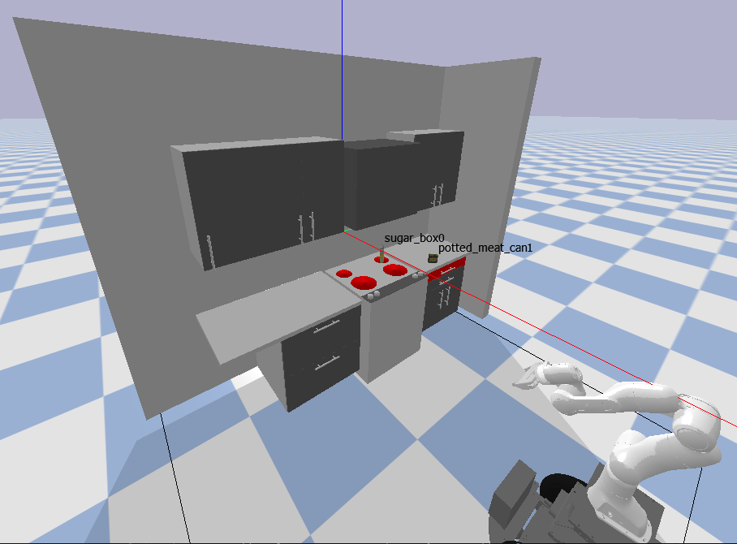

# Principles of Autonomy Project, Fall 2022 #
*Team Members: Justin Poh & Corwin Stites*

## Contents ##
1. [Introduction](#Introduction)
2. [Part 1: Activity Planning](#Part-1-Activity-planning)
3. [Part 2: Motion Planning](#Part-2-Motion-Planning)
4. [Part 3: Trajectory Optimization](#Part-3-Trajectory-Optimization)


## Introduction 

The objective of this project was to implement activity planning, motion planning and trajectory optimization for a robot (the "Franka-Carter" - a Franka arm mounted on a carter mobile base) to enable it to accomplish pick and place tasks involving two objects - a sugar box and a potted meat can. 

Specifically, there were 2 tasks the robot had to accomplish: 
1. Locate the sugar box and place it on a nearby countertop 
2. Locate the potted meat can and place it in the red drawer

The starting position of the robot and objects in the environment is shown in the image below:

<p align="center">

</p>

This writeup begins by describing the implementation of activity planning where the sequence of activities required to accomplish both tasks is generated. 

The next section describes our implementation of motion planning where the motion paths of the base and arm that are needed to accomplish each activity in the generated activity plan is determined. 

Finally, the last section describes our implementation of trajectory optimization where an optimized trajectory of the robot arm is generated using a non-linear constrained optimization problem formulation.

## Part 1: Activity Planning

### Domain Assumptions ###

We have the following types in our domain:

- location: Represents locations in the kitchen.
- item: Represents items in the kitchen.
- arm : Representsthe robotic arm.

We have the following predicates in our domain:

- opened: Records if a location is open or not (this predicate along with closed is used for locations that are drawers).
- closed: Records if a location is closed or not.
- openable: Records if a location can be opened. This differentiates between counters and drawers.
- gripped: Records if an item is being gripped by the robot arm.
- free: Records if the item is not being gripped by the robot arm.
- itemat: Records what location a specific item is at.
- itemin: Records if an item is in an openable location. 
- armat: Records what location the arm is at.
- empty: Records if the arm is holding an item.
- surface: Records if a location is a surface or a cabinet.

We have the following actions in our domain:

- open: This opens a location. It requires the arm to be at the location and empty and for the location to be openable and closed. It makes the location opened and not closed.
- close: This closes a location. It requires the arm to be at the location and empty and for the location to be openable and open. It makes the location closed and not open.
- grip: This causes an item to be gripped by the arm. The arm must be empty, the item must be free, and the arm and item must be at the same location. It causes the arm to be not empty. It causes the item to be not free and gripped. It also causes the item to not be in the location anymore. This is because if the item is gripped, we assume it is in the same location as the arm. This means it is redundant to keep track of both locations.
- placein: This places the object in an openable location. It requires the item to be gripped, the arm at the location, and the location to be opened. This makes the the arm empty. It also makes the item free, not gripped, and makes itemat and itemin the location. We make both itemat and itemin satisified since itemat is the main predicate to keep track of an item's 
- location. We use itemin as a stronger condition to keep track of items in openable locations. 
- placeon: This places the object at a non- openable location. It requires the item to be gripped, the location to be a surface, and the arm at the location. This makes the the arm empty. It also makes the item free, not gripped, and makes itemat the location. 
- move: This moves the arm from one location to another. The arm must be in the start location. It causes the arm to be at the end location and not at the start location.

It is worth noting that the way we have defined the grip action will allow an item to be gripped even if the drawer is closed, which is not a realistic behavior. We could adjust our defined predicates to avoid this problem but have chosen not to do so since the tasks defined in the project do not require an item to be retrieved from the drawer. We are therefore assuming that this definition of actions will not be applied to a problem in which items will need to be retrieved from the drawer.


### Plan Generation ###

We start with an initial fact layer. We expand our actions in the action layer which have their preconditions satisfied by our current fact layer. We then use the action layer to generate new facts from the effects of the actions in the action layer. We then do a union of the new facts with the previous fact layer in order to carry over new facts and facts resulting from no-op. We carry out this process until the goal appears in our fact layer. To keep track of the connections between facts and actions, at each fact layer we create a dictionary. The keys in the dictionary are made up of the facts in the layer while the entries associated with each key are the actions that the fact resulted from. Critically, this is only carried out for facts that were not in the previous fact layer i.e. not facts that were carried over by the no-op. Using this strategy we can follow the RPG backwards from a fact in order to count actions for the fast forward heuristic value. We then use the heuristic value to inform an Enforced Hill Climb algorithm. At each action selection we look for a state with a decreasing heuristic value. If we cannot find a decreasing heuristic value, BFS is used to determine the next action.


### Challenges Faced ###

Previously we were also creating connections to facts that were carried over by the no-op. This was causing us to have way to many fact to action connections as we worked backward through the RPG. This resulted in our fast forward heuristic value being way to high for any given fact. 

## Part 2: Motion Planning

### Overview
In this section, our implementation of motion planning will be described. We begin this section by providing an overview of how our code works and then subsequent sections explain the various parts of our code in more detail. 

For our project, we decided to use Rapidly Exploring Random Trees (RRT) as our motion planning algorithm for both the base and the arm. The configuration space of the base is defined in terms of 3 variables: x position, y position and heading. The configuration of the arm is defined in "joint space" and thus defined by 7 variables - the joint angles for the 7 joints of the Franka arm.

To integrate the activity planner and the motion planner, we also implemented an execution engine. This execution engine essentially performs the following steps:
1. Generate the activity plan using the activity planner described in part 1
2. For each activity in the actvity plan, the execution engine does the following: 
    * Determine what activity needs to be performed 
    * Convert the named goal location for the activity into a numeric goal position
    * Pass the relevant goal position to the motion planner to solve for required motion plan
    * Store the generated motion plan for visualization later
5. Once all activities have been planned, the execution engine then visualizes the entire motion plan

This sequence of actions can be found in the ```run``` class method of the execution engine.

The key files for this part are:
* The execution engine is defined in ```run_project.py``` located in the top-level folder
* The motion planner is defined in ```MotionPlanner/RRT.py```

### Assumptions ###
Our implementation of the motion planner and execution engine makes the following assumptions:
1. We assume that the **<ins>base is holonomic</ins>** and therefore base only needs to either move in a straight line from start to end position or to rotate from one heading to another. Thus, our motion planner only samples (x,y) positions and the heading of the robot is determined based on the direction of travel needed to get from (x_1, y_1) to (x_2, y_2) for each pair of waypoints in the path.
2. We assume that the **<ins>kitchen furniture and appliances will not change dimensions or location </ins>** from those given at the start of this project. Based on this assumption, the following hard-coded values exist in our code:
    * The x-position of all base goal locations is hardcoded to be x=0.7
    * To avoid infeasible plans occurring around the red drawer area, the robot is positioned in front of the stove for any interactions needed with the right-side countertop or drawers. To do this, all goal locations with "indigo" in the name have hardcoded base goal locations of (0.7, 0.55)
    * When placing the sugar box down on the countertop, the target x-position is hardcoded to be +0.3m of the center point of the counter top and the target y-position is hardcoded to be +0.3m of the center point of the countertop
    <!-- * When placing the potted meat can down on the countertop, the position is hardcoded to be ???  -->
3. We also assume that **<ins>objects do not move or change dimensions </ins>**. Thus, the grasp poses (both (x,y,z) position and quaternion) for the sugar box and potted meat can are predetermined and hardcoded into the execution engine 
4. We assume a **<ins>hard-coded goal position to park the arm </ins>** when retrieving or placing objects. This is defined by the parked joint angle for each of the 7 arm joints.
5. We assume that we can **<ins>ignore the gripping dynamics of the robot arm </ins>**. Thus, our code does the following for gripping objects and opening/closing the drawer 
    * When the end effector enters within the goal radius of an object it is trying to grip, the object is simply attached to the arm. The object then moves jointly with the end effector of the arm until the object is released.
    * When the end effector enters the goal radius of the drawer handle, the arm simply moved by a fixed amount in the positive or negative x-direction to open or close the drawer respectively. At each time step, the drawer position is then set to equal the amount that the arm moved in that time step.
6. We assume that the **<ins>drawer has a fixed length that will not change </ins>**. Thus, in our code, the arm opens the drawer by a hard-coded distance of 0.35

### Motion Planner Implementation ###

Our motion planenr is implemented as a MotionPlanner class and is initialized with the following parameters that are relevant for RRT: 


To get a motion plan, the execution engine calls the class method ```plan```. This function which is a class method of MotionPlanner. This function initializes the search tree and performs RRT for 10,000 iterations. If a path from start to goal is not found within 10,000 iterations, a ValueError is raised to indicate that no path was found. 

The following are the key functions performed or called by ```plan```:
1. ```get_random_sample```: This function draws random samples for either the base or arm. An input argument to this function is used to indicate if the full configuration space should be sampled or if a sample should be obtained from the goal region. Sampling from the goal region is done by setting the lower bound and upper bound of the "custom limits" for the relevant joints to the lower and upper bound of the goal region.
2. ```get_nearest_node```: This function uses scipy's kdtree implementation to get the nearest neighbor to the randomly sampled point. If plannning the base motion, the nodes in the tree are (x,y) points. If planning the arm motion, the nodes in the tree are 7-element tuples representing the joint angle for each of the 7 arm joints. 
3. ```steer```: This function determines the direction vector between the randomly sampled point and the nearest node. If the distance is smaller than the d value for the arm or base (whichever is being planned), the randomly sampled point is returned as the next possible point in the tree. If the distance is larger than the relevant d value, a point of distance d away from the nearest node along the direction vector is returned as the next possible point in the tree.
4. ```obst_free```: This function performs obstacle checking by first interpolating intermediate positions of the base or arm (whichever is being planned) between the nearest node and the new node. This interpolation includes determining the heading of the base needed to travel along the direction vector and interpolating the headings needed to rotate the base into the new heading (based on the heading of the direction vector) and the prior heading. For every interpolated position of either the base or arm, the collision checks are performed:
    * Collision bewteen robot body and the objects (sugar box and potted meat can). If an object is currently being grasped, collisions with that object are ignored
    * Collisions between the robot body and any of the cabinets, countertops and appliances. If the drawer is being opened or closed, ignore collisions with the drawer handle
    * If an object is being grasped, check collisions between that object and any of the kitchen cabinets, countertops and appliances
5. If all collision checks pass, the point is then added to the tree and the interpolated path generated during obstacle detection is stored together with the new point
6. ```in_end_region``` and ```retrieve_path```: If the new point is within the goal region, the path from start to end is retreived. This is done by starting with the end point and prepending each set of interpolated paths to the path list until the start point is reached. Once done, the path list contains every interpolated point from the start to the end point and this path is then returned to the execution engine.

### Integrating the Activity Plan with the Motion Plan ###

The following are the key functions performed by the execution engine to integrate the activity plan with the  motion plan:
<!-- 1. ```create_world```: This function creates the simulation world and places the robot, sugar box and potted meat can at their start position. The execution engine calls this function on initialization to create the world that will be used for motion planning. Once all motion plans have been generated, the execution engine destroyes the world and creates a new copy of the world to use for visualizing the plan. -->
1. ```create_maps```: This function creates a map of all kitchen location and object names into numeric goal positions for the robot arm or base. These mappings are used by the plan_action function (see below) to convert the location or object names that appear in each action to the (x,y) position or grasp pose that each name represents. Kitchen locations are mapped into (x,y) positions based on their location in the simulated world and subject to the assumptions listed above. Objects are mapped to grasp poses that are predetermined and hardcoded into the execution engine as stated in the assumptions above.
2. ```plan_action```: This function is called for each action in the activity plan. In addition to using the mappings to convert location and object names to goal positions for the motion plannner, this function does the following for each action:
    * <ins>For a move action</ins>, call the motion planner to create a motion path for just the base to reach the goal location
    * <ins>For an open or close action</ins>, use the motion planner to move the arm into position to first grasp the drawer handle. Then, if opening the drawer, use the motion planner to move the arm either +0.35m (if opening) or -0.35m (if closing) in the x-direction to open or close the drawer. Once the drawer is opened or closed, use the motion planner to plan one more action in +0.1m in the x-direction to move away from the drawer handle before moving on to the next action
    * <ins>For a grip action</ins>, use the motion planner to move the arm into the required grasp pose, then the actual grasp height of the end effector is measured. This is done so that the goal position to place the object can be modified to account for the actual grasp height of the end effector. The fingers on the end effector are then closed. The motion planner is then used to move the arm (and object) back to the hardcoded arm park position before proceeding to the next action
    * <ins>For a placein or placeon action</ins>, calculate the final pose to place the object in the drawer or on the countertop based on the mappings and the actual grasp height measured earlier. The motion planner is then used to move the arm (and object) back to the hardcoded arm park position before proceeding to the next action
3. ```execute_action```: Converting each activity in the activity plan into a defined numerical end goal for the motion planner to generate the motion plan

### GIF of Robot Executing the Plan ###


*Note: the above GIF shows the robot placing the potted meat can on the drawer handle instead of in the drawer. To fix this, we recognize that our code needs an additional offset factor in the x-direction from the drawer handle when calculating the goal position for placing the potted meat can in the drawer. However, we ran out of time to implement this offset factor and record a new video.*

### Challenges Faced ###

A key challenge we faced was dealing with the format of our samples when sampling for our RRT* planner. The samples provided from functions within the utils.py file in ss-pybullet gave us a sample in the format of joint angles for each joint along the arm rather than cartesian coordinates of the end effector. We at first tried to find a way to convert this sample format to a cartesian point, but utlimatley, we were able to make the motion planner work using the original format of the sampler output. 

Another key challenge we faced was figuring out how to perform efficient collision checking between links of the robot to make sure that the robot could not collide with itself. Although we could perform pairwise link collision checking, we found that pybullet's pairwise link collision checking function was very slow. Since our existing planner didn't seem to have too many problems with the robot colliding into itself, we decided not to keep trying to implement this aspect of collision checking. As such, this is a significant limitation of our implementation - that there is the possibility that a motion plan for the arm is generated that causes the arm to collide with itself.

## Part 3: Trajectory Optimization