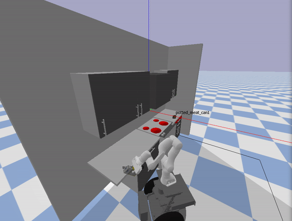

# Principles of Autonomy Project, Fall 2022 #
*Team Members: Justin Poh & Corwin Stites*

## Contents ##
1. [Introduction](#Introduction)
2. [Part 1: Activity Planning](#Part-1-Activity-planning)
3. [Part 2: Motion Planning](#Part-2-Motion-Planning)
4. [Part 3: Trajectory Optimization](#Part-3-Trajectory-Optimization)


## Introduction 

The objective of this project was to implement activity planning, motion planning and trajectory optimization for a robot consisting of a Franka arm and mobile base to accomplish two pick and place tasks: 
1. Place the sugar box on a nearby countertop 
2. Place the potted meat can in the red drawer

## Part 1: Activity Planning

### Domain Assumptions ###
Our implementation of activity planning makes the following assumptions:
1. We assume that items to be gripped will always be directly accessible (e.g. no need grip an item inside a closed drawer/cabinet). 
2. We assume that the red drawer is the only location that items need to be stored in.
3. We assume that once gripped, an item has the same location as the robot arm and the item will not have its own associated location until it is released.
4. We assume that the act of grasping/releasing objects includes moving the arm into the grasp pose. As such, there is no separately defined arm movement action.
5. We assume that locations do not have a maximum storage capacity for items.

### Key Files and Functions ###

The key files for activity planning can be found in the ```ActivityPlanner``` folder. They are:
1. ```kitchen.pddl```: Defines the kitchen domain including the main locations, objects and possible actions.
2. ```pb1.pddl```: Defines the problem to be solved by the activity planner. including the initial and goal states.
3. ```ff_planner.py```: Defines the functions needed to carry out activity planning.


### Generating the Activity Plan ###
Our activity plan is generated using an enforced hill climb algorithm implemented by the ```enforced_hill_climb``` function in ```ff_planner.py```. Starting with the initial fact layer, the ```expand_state``` function identifies all feasible actions and the resulting (child) fact layer for each action (accounting for delete effects). The ```calculate_heuristic``` function then calculates the fastforward (FF) heuristic for each child fact layer.

If one of the possible next actions has a lower heuristic value than the incumbent (i.e. the lowest heuristic value found so far), the first action with a lower heuristic value is selected as the next action to take

However, if none of the actions have a lower heuristic value but at least one of them has the same heuristic value as the incumbent, then a plateau has been reached and the ```resolve_plateau``` function resolves the plateau by performing breadth-first search (BFS) to search child states until a sequence of actions is found that has a lower heuristic value than the incumbent.

The fact layer associated with the selected action is then expanded and this process repeats until the goal state is reached.

### Calculating the FF Heuristic ###

The FF heuristic is essentially an estimate of the number of actions remaining to reach the goal. ```calculate_heuristic``` calculates this heuristic based on a relaxed plan graph (RPG) as follows:
1. ```compute_rpg``` computes the RPG by starting with a given current state and generating the sequence of alternating fact and action layers, ignoring the delete effects of actions. Between fact layers, we carry over facts resulting from no-op from the previous fact layer. To facilitate calculating the FF heuristic, links are maintained between each new fact (i.e. facts not carried over by the no-op) in a fact layer and the action that added that fact.
2. ```extract_heuristic``` then takes the generated RPG and follows the links between fact and action layers backwards from the final fact layer to the starting fact layer, counting the actions needed along the way to achieve the goal state. The number of actions counted is returned as the heuristic value.


### Challenges Faced ###

The key challenge we faced was that our FF heuristic planner was creating connections between facts that were carried over by the "no-op" and actions in the preceding action layer. As a result, our FF heuristic values were much larger than expected. By adding links only between new facts and actions, we were able to resolve this problem.

## Part 2: Motion Planning

### Overview
Our motion planner implements Rapidly Exploring Random Trees (RRT) for both the base and the arm. The motion of the base is planned in terms of (x position, y position, heading) while the arm is planned in "joint space", which is defined by the 7 joint angles for the Franka arm.

The key files for this part are:
* The execution engine is defined in ```run_project.py```
* The motion planner is defined in ```MotionPlanner/RRT.py```

### Assumptions ###
Our implementation of the motion planner and execution engine makes the following assumptions:
1. We assume that the **<ins>base is holonomic</ins>** and either moves in a straight line or rotates from one heading to another
2. We assume that the **<ins>kitchen environment is fixed and static </ins>**. Thus, the following values are hardcoded:
    * All base goal points are hardcoded to have x=0.7
    * To ensure plans around the red drawer are always feasible, all interactions with the right-side countertop or drawer are performed from a hardcoded position in front of the stove at (0.7, 0.55)
    * When placing the sugar box down on the countertop, the target offsets from the centerpoint of the countertop are hardcoded
    * The arm opens the drawer by a hard-coded distance of 0.35
3. We assume that **<ins>objects are static and always start at the same position</ins>**. Thus, the grasp poses for the sugar box and potted meat can are predetermined and hardcoded 
4. We assume that we can **<ins>ignore the gripping dynamics of the robot arm </ins>**. Thus:
    * Objects are grasped by attaching them to the end effector and moving them jointly with the end effector until the object is released
    * To open/close the drawer, the arm simply moves by a fixed amount in the x-direction and the drawer position is set to equal the distance that the arm moved

In addition, there is a hardcoded park position that we use to stow the arm.

### Motion Planner Implementation ###

To get a motion plan, the execution engine calls the MotionPlanner class method ```plan``` which performs standard RRT. Some notable aspects of our implementation:
1. <ins>Random Sampling</ins>: Random samples for the base or arm are drawn from either the goal region (for goal biasing) or the full configuration space. Sampling from the goal region is done by setting the lower and upper bound of the goal region as "custom limits" for the relevant joints
2. <ins>Collision Checking </ins>: To ensure the whole path is collision free, our motion planner first interpolates intermediate positions of the base or arm (whichever is being planned) between the nearest node and the new node. This includes interpolating the heading of the robot. Then, for every interpolated position, the following collision checks are performed:
    * Collision between robot body and objects (i.e. sugar box and potted meat can). Collisions with an object are ignored if it is grasped
    * Collisions between the robot body and any of the cabinets, countertops and appliances. If the drawer is being opened or closed, collisions with the drawer handle are ignored
    * If an object is being grasped, check collisions between that object and any of the kitchen cabinets, countertops and appliances
3. <ins>Path Retrieval</ins> When retrieving the path, every interpolated point from start to end is retreived and returned to the execution engine.

### Integrating the Activity Plan with the Motion Plan ###

The following key functions are used to integrate the simulation, activity plan and motion plan:
1. ```create_maps```: This function creates a map of all kitchen location and object names to numeric goal positions or grasp poses for the robot arm or base based on their locations in the simulation
2. ```get_activity_plan```: This function generates the activity plan using the activity planner described in part 1
2. ```plan_action```: For each activity in the generated activity plan, this function uses the motion planner to do the following:
    * <ins>For a move action</ins>, create a motion plan for just the base to reach the goal location
    * <ins>For an open or close action</ins>, create a motion plan to 1) Move the arm to grasp the drawer handle, 2) Open or close the drawer and then 3) Move the arm by 0.1m away from the drawer handle
    * <ins>For a grip action</ins>, create a motion plan to move the arm into the required grasp pose, close the fingers, then move the arm (and object) to the park position
    * <ins>For a placein or placeon action</ins>, calculate the final pose to place the object in the drawer or on the countertop and create a motion plan to move the arm (and object) into that pose, release the object and move the arm back to the park position
3. ```execute_action```: Once motion planning is complete, this function is called on each action in the activity plan to visualize the motion plans geneated by ```plan_action``` in the simulation. In addition, this function also creates and removes any necessary attachments of objects to the arm or to the drawer.

### GIF of Robot Executing the Plan ###

<p align=center>

</p>

*Note: We recognize that our code needs additional offset factors to properly place the potted meat can in the drawer. However, we ran out of time to implement this and record a new video.*

### Challenges Faced ###

A key challenge we faced was deciding what configuration space to plan the arm motions in. At first, we tried to plan in cartesian coordinates but struggled to convert a set of joint angles (from the random sample) into the resulting end effector pose. We ultimately decided it would be easier to plan in joint space instead. 

Another key challenge we faced was figuring out how to perform efficient collision checking between robot links to make sure that the robot could not collide with itself. We started by using pybullet's pairwise link collision checking but found that function to be very slow. Since our existing planner didn't seem to have too many problems with the robot colliding into itself, we decided not to keep trying to implement this aspect of collision checking. As such, this is a significant limitation of our implementation - that there is the possibility that a motion plan for the arm is generated that causes the arm to collide with itself.

## Part 3: Trajectory Optimization

### Formal Definition of Optimization Problem ###
Our formal non-linear optimization problem is formulated as follows:

$$
\begin{align*}
\text{minimize} \quad & \sum_{i,t} |j_{i+1,t}-j_{i,t}|, \; \forall \;\; i \; \in \; [0,5], \; t \; \; \in \; [t_o, t_f]\\
\text{subject to} \quad & L_{lb_i} \leq j_{i,t} \leq L_{ub_i}, \; \forall \;\; i \; \in \; [0,6], \; t \; \; \in \; [t_o, t_f] \quad \text{(Constrains each joint within joint limits.)} \\
& S_{lb_i} \leq j_{i,t_0} \leq S_{ub_i}, \; \forall \;\; i \; \in \; [0,6]\quad \text{(Constrains each joint within a start range.)}\\
& E_{lb_i} \leq j_{i,t_f} \leq E_{ub_i}, \; \forall \;\; i \; \in \; [0,6]\quad \text{(Constrains each joint within an end range.)}\\
& C_{lb_x} \leq x_t \leq C_{ub_x}, \; (x_t, y_t, z_t) = f(j_{0:6,t}) \; \forall \;\; t  \; \in \; [t_o, t_f]\quad \text{(Constrains the end effector from entering the x-axis bounds of the cabinets.)}\\
& C_{lb_y} \leq y_t \leq C_{ub_y}, \; (x_t, y_t, z_t) = f(j_{0:6,t}) \; \forall \;\; t  \; \in \; [t_o, t_f]\quad \text{(Constrains the end effector from entering the y-axis bounds of the cabinets.)}\\
& C_{lb_z} \leq z_t \leq C_{ub_z}, \; (x_t, y_t, z_t) = f(j_{0:6,t}) \; \forall \;\; t  \; \in \; [t_o, t_f]\quad \text{(Constrains the end effector from entering the z-axis bounds of the cabinets.)}\\
& B_{lb_x} \leq x_t \leq B_{ub_x}, \; (x_t, y_t, z_t) = f(j_{0:6,t}) \; \forall \;\; t  \; \in \; [t_o, t_f]\quad \text{(Constrains the end effector from entering the x-axis bounds of the base.)}\\
& B_{lb_y} \leq y_t \leq B_{ub_y}, \; (x_t, y_t, z_t) = f(j_{0:6,t}) \; \forall \;\; t  \; \in \; [t_o, t_f]\quad \text{(Constrains the end effector from entering the y-axis bounds of the base.)}\\
& B_{lb_z} \leq z_t \leq B_{ub_z}, \; (x_t, y_t, z_t) = f(j_{0:6,t}) \; \forall \;\; t  \; \in \; [t_o, t_f]\quad \text{(Constrains the end effector from entering the z-axis bounds of the base.)}\\
& \bigg | \frac{j_{i,t_{\lambda}} - j_{i,t_{\lambda-1}}}{t_{\lambda} - t_{\lambda-1}} \bigg | \leq 2.62, \; \forall \;\; i \; \in \; [0,3], \;  \lambda \; \in \; [0,len(t)]\quad \text{(Constrains the first four joints to their maximum angular velocity.)}\\
& \bigg | \frac{j_{i,t_{\lambda}} - j_{i,t_{\lambda-1}}}{t_{\lambda} - t_{\lambda-1}} \bigg | \leq 5.25, \; \forall \;\; i \; \in \; [4,6], \;  \lambda \; \in \; [0,len(t)]\quad \text{(Constrains the last three joints to their maximum angular velocity.)}\\
\end{align*}
$$

The decision variables in the optimization problem are the angles of each arm joint at each time step. The decision variables are stored in the matrix $J_{i,t}$ where $j_{i,t}$ represents the joint angle of th $i$-th joint at the $t$-th timestep. Our cost function seeks to minimize the sum of all joint angle displacments over all joints and all timesteps. Fundementally, this means we are trying to minimize the distance all links in the arm move, and by extension, minimize the distance the end effecto needs to travel to reach its goal. 

We start by creating a constraint which limits each joint to within its manufacturer-specified joint limits at each time step. We also express a constraint which limits each joint at the first timestep to its starting position, as well as a constraint which limits each joint at the last timestep to its end position. We use upper and lower bounds for each joint to accomplish the preceding constraints. 

We then express collision constraints to prevent the end effector from colliding with the robot base and kitchen cabinets. We do this using the function $f(j_{0:6,t})$ which we define as a forward kinematics function which returns the cartesian coordinates of the end effector at timestep $t$ from the joint angles $j_{0:6}$. Collisions are avoided by ensuring the end effector never enters the volumes that define the robot base and kitchen cabinets

Finally, we express the constraints which limit the maximum angular displacment per timestep length to the manufacturer specified maximum joint angular velocity (2.62 rad/s for the first three joints, and 5.25 rad/s for the last four). 

While we included collision constraints in our formal problem definition, in the code implementation of the solver we choose not to include collision constraints. This is because we did not experience collisions in our optimum plan for our choosen trajectory even with collision constraints relaxed. Therefore, we chose not to implement them to reduce complexity, 

### Key Files and Functions ###
```traj_opti_solver.py``` implements the above problem formulation using pydrake's SNOPT solver. <br>
```traj_opt_data.py``` saves the motion plan generated from our RRT planner and saves it in a CSV format. It then passes the start and end points of the RRT motion plan to the solver function which uses those points as its initial guess.

### Comparison of RRT-Generated v.s. Optimized Trajectories ###

The GIFs below show that the unoptimized trajectory generated by RRT includes several random, suboptimal movements of the arm whereas the optimized trajectory essentially interpolates straight from the start to the goal points.
<p align=center>


<br>
Left: Unoptimized trajectory &nbsp;&nbsp;|| &nbsp;&nbsp; Right: Optimized trajectory
</p>

As shown in the two GIFs above, it can be seen that the RRT-generated trajectory is not optimal because it contains several unnecessary movements of the arm. By contrast, the optimized trajectory moves the arm as directly as possible from the start to the goal position without those unecessary movements.

### Challenges Faced ###
One of the challenges we faced was figuring out how to implement the joint limit and max joint velocity constraints. We initially wanted to encode that as one constraint that checks the entire matrix of decision variables but realized pydrake does not allow constraints to be defined this way. Ultimately, we decided to implement these constraints separately for each joint.